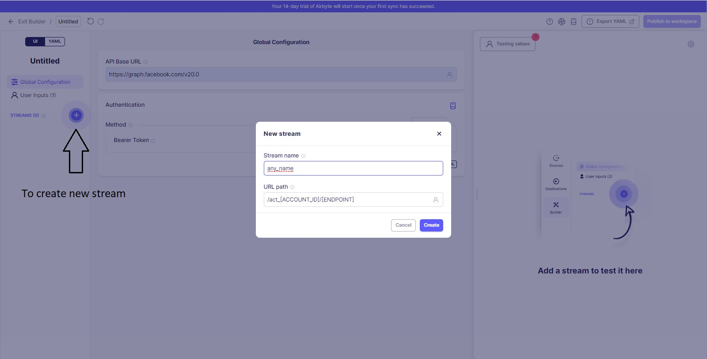

# Custom Data Extraction Using Meta Marketing API

## Using Airbyte
-----------------------------
### Steps to get the JWT to use in Airbyte
1. You should have connected your fb Account as "source" so you can extract the data
2. You need to go to your app (marketing account) to extract app-id, and app-secret and save them for further steps
3. Third step is to generate **ACCESS TOKEN** from the [Graph API Explorer](https://developers.facebook.com/tools/explorer)
4. Put this URL path to the input window in the Graph API Explorer page
``` /oauth/access_token?grant_type=fb_exchange_token&client_id={app-id}&client_secret={app-secret}&fb_exchange_token={your-access-token} ```
5. Change what is between **{__}** to your own informations as mentioned in 2, 3
6. As a result, you will get a **JWT** to use in [AIRBYTE](https://airbyte.com/)

### Steps to Create custom connector in Airbyte
1. Creating a custom connector *Start from scratch* 
2. Configuration, use this basic link https://graph.facebook.com/v20.0 -need to check the version (v20.0) for update. 
3. Method, we choose Bearer to use our *JWT* 
4. Click on testing values to open another window then add JWT as API key 
5. Creating a stream to use the endpoints. Each stream for specific endpoint 
6. a) Stream name, any name you want can be added
    b) URL path, it should be like this /**act_**{ACCOUNT_ID}/{ENDPOINT}, example /act_1234567891011123/insights

### Steps to build the connector
1. HTTP Method, it depends if you are sending Request (use **POST**), if sending parameters (use **GET**)
2. Check the Reocrd Selector, Field Path is what is the of the data came in the respond
3. Next, Add Query Parameters, ex: 

| **KEY:** | **Value:** |
| -------- | ---------- |
| fields   | id,name,body |
| breakdowns | age,country |
| time_range | {"since":"yyyy-mm-dd", "until":"yyyy-mm-dd"} |
| time_increment | 1 or 7 or monthly |
--> [Check doc for more info](https://developers.facebook.com/docs/marketing-api/conversions-api/using-the-api)

4. Check this for limit specifiction 

## Conclusion
- Following steps, you will be able to build your first custom connector on Airbyte using Facebook marketing API.
